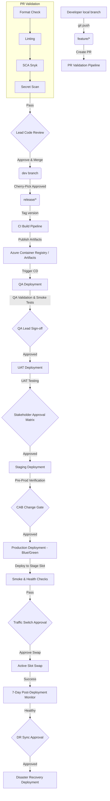

# Master Index & Architecture Blueprint

Welcome to the Enterprise Azure DevOps CI/CD Platform Guide. This master document serves as the architectural foundation and cross-cutting blueprint for the entire implementation. Use this to orient yourself before proceeding to individual phase guides.

---

## 1. Directory & Repository Structure

To support enterprise scale, we organize our repository layout and Azure DevOps project structures systematically.

### 1.1 Application Repository Structure
For an enterprise application (e.g., a microservice or web application), the repository is structured as follows:

```text
├── .gitleaks.toml                # Secrets scanning custom configurations
├── .sonarcloud.properties        # SonarCloud analysis properties
├── checkov-config.yml            # Infrastructure-as-Code scan configuration
├── package.json                  # Application dependencies & scripts
├── src/                          # Application source code
│   ├── app.js
│   └── tests/                    # Unit & Integration tests
├── pipelines/                    # CI/CD Pipeline Definitions
│   ├── pr-validation.yml         # PR Validation Entrypoint
│   ├── build.yml                 # Build/CI Entrypoint
│   ├── cd-release.yml            # Multi-stage Release Entrypoint
│   └── templates/                # Reusable YAML templates
│       ├── format-lint.yml
│       ├── security-scans.yml
│       ├── docker-build.yml
│       └── deploy-stage.yml
```

### 1.2 Azure DevOps Project Structure
An Azure DevOps project contains several functional hubs:

```text
Project: [Enterprise-Platform-Core]
├── Repos (Git Repositories)
│   └── core-app                  # Primary application repository
├── Pipelines (YAML Pipelines)
│   ├── PR-Validation             # Connected to pr-validation.yml
│   ├── CI-Build                  # Connected to build.yml
│   └── CD-Release                # Connected to cd-release.yml
├── Library (Shared Assets)
│   ├── Variable Groups           # vg-shared, vg-qa, vg-uat, vg-prod, vg-dr
│   └── Secure Files              # sonarqube-cert.pfx, app-service-cert.pfx
└── Environments
    ├── env-qa                    # QA environment with manual checks
    ├── env-uat                   # UAT environment with multi-approvals
    ├── env-stage                 # Stage environment with gates
    ├── env-prod                  # Prod environment with Blue-Green slot swaps
    └── env-dr                    # Disaster Recovery environment
```

---

## 2. Naming Conventions

Consistency across naming prevents configuration drift and simplifies permission management.

| Resource Type | Convention Template | Example |
| :--- | :--- | :--- |
| **Organization** | `org-[company-name]` | `org-enterprise-acme` |
| **Project** | `prj-[business-unit]-[app-group]` | `prj-fin-corebanking` |
| **Git Repository** | `repo-[app-name]` | `repo-payment-gateway` |
| **YAML Pipelines** | `pipe-[app-name]-[purpose]` | `pipe-payment-gateway-ci` |
| **Variable Groups** | `vg-[env-name]-[purpose]` | `vg-prod-dbcredentials` |
| **Service Connection** | `sc-[target-resource]-[env-name]` | `sc-azure-subscription-prod` |
| **Agent Pools** | `pool-[os-type]-[purpose]` | `pool-ubuntu-build-large` |
| **Environments** | `env-[env-name]` | `env-uat` |

---

## 3. RBAC (Role-Based Access Control) Model

We implement the Principle of Least Privilege across all scopes of Azure DevOps.

| Security Scope | Role / Group | Assigned To | Permissions Level |
| :--- | :--- | :--- | :--- |
| **Organization** | Project Collection Admin | Lead Platform Architect | Full control over organization settings, billing, and projects. |
| **Project** | Project Administrators | DevOps Engineers | Full control over project configurations, service connections, pools. |
| **Repository** | Contributors | Developers | Read, Write, Create Branch, Create Pull Request. |
| **Repository** | Project Administrators | Release Managers | Bypass branch policies (restricted), force push (disabled in prod). |
| **Pipelines** | Build Administrators | DevOps Leads | Create, Edit, and Delete pipelines and variable groups. |
| **Library** | Reader | Build Service Account | Read access to variable groups and secure files during runtime. |
| **Service Connections**| User | Build Service Account | Reference service connections in YAML pipelines. |

---

## 4. End-to-End Deployment Flow

Below is the visual lifecycle of a single feature commit traveling from a developer's machine to Production and Disaster Recovery.



---

## 5. Environment & Approval Matrix

Different environments require varying levels of scrutiny before deployments are permitted.

| Environment | Purpose | Target Azure SKU (Cost-Optimized) | Approval Requirements | Deployment Strategy |
| :--- | :--- | :--- | :--- | :--- |
| **QA** | Automated testing, QA verification | App Service Free Plan (F1) | Automated validation only | Recreate / RunOnce |
| **UAT** | User Acceptance Testing, Demo | App Service Shared Plan (D1) | Stakeholder (PO / QA Lead) Approval | Rolling deployment |
| **Stage** | Pre-production testing, integration | App Service Basic Plan (B1) | Lead Developer Approval | Rolling deployment |
| **Prod** | Production traffic | App Service Basic Plan (B1) with Slots | Multi-approval (CAB, DevOps Lead, PM) | Blue-Green Slot Swap |
| **DR** | Disaster Recovery failover target | App Service Basic Plan (B1) | Enterprise Release Manager Approval | Active-Passive Recreate |

---

## 6. Table of Contents / Phase Guides

Follow the phase guides in sequential order to implement the enterprise platform step-by-step:

1. **[Phase 1: Azure DevOps Fundamentals](file:///h:/trainee-docs/azure-devops/phase-01-fundamentals.md)** - Setting up the organization, projects, pools, and service connections.
2. **[Phase 2: GitFlow Implementation](file:///h:/trainee-docs/azure-devops/phase-02-gitflow.md)** - Branch models, policies, PR restrictions, and cherry-picking workflows.
3. **[Phase 3: PR Validation Pipeline](file:///h:/trainee-docs/azure-devops/phase-03-pr-validation.md)** - Standardizing formatting, linting, SCA, and basic secrets protection.
4. **[Phase 4: DevSecOps Integration](file:///h:/trainee-docs/azure-devops/phase-04-devsecops.md)** - Advanced SonarCloud SAST, Checkov IaC, Trivy container scanning, and security gates.
5. **[Phase 5: Build Pipeline](file:///h:/trainee-docs/azure-devops/phase-05-build-pipeline.md)** - Enterprise build configurations, semantic versioning, and test coverage publishing.
6. **[Phase 6: Artifact Management](file:///h:/trainee-docs/azure-devops/phase-06-artifact-management.md)** - Feed management, Azure Container Registry configuration, and secure feed auth.
7. **[Phase 7: Environment Architecture](file:///h:/trainee-docs/azure-devops/phase-07-environment-architecture.md)** - Environment governance, pre/post checks, exclusive locks, and gates.
8. **[Phase 8: Release Pipeline](file:///h:/trainee-docs/azure-devops/phase-08-release-pipeline.md)** - Multi-stage deployments, runOnce/rolling jobs, and rollback strategies.
9. **[Phase 9: Blue-Green Deployment](file:///h:/trainee-docs/azure-devops/phase-09-blue-green-deployment.md)** - Azure App Service slot swaps, traffic routing, canary verification, and slot-specific variables.
10. **[Phase 10: Production Governance](file:///h:/trainee-docs/azure-devops/phase-10-production-governance.md)** - ITSM/ServiceNow integrations, application insights logging, and production KQL.
11. **[Phase 11: Disaster Recovery](file:///h:/trainee-docs/azure-devops/phase-11-disaster-recovery.md)** - Multi-region DR architecture, DNS failovers, active-passive sync, and failback plans.
12. **[Phase 12: Security and Compliance](file:///h:/trainee-docs/azure-devops/phase-12-security-compliance.md)** - Key Vault integration, managed identities, audit log query systems, and compliance audits.
