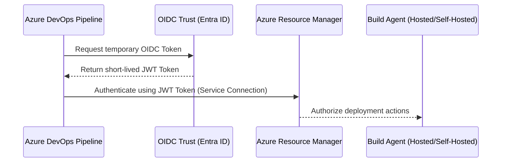

# Phase 1: Azure DevOps Fundamentals

This phase covers the foundational building blocks of Azure DevOps. You will learn how organizations, projects, and permissions are structured, how to connect Azure DevOps securely to your Azure subscription, and how to manage agent pools and variables.

---

## 1. Theory & Conceptual Architecture

### 1.1 Organizational Hierarchy
Azure DevOps uses a hierarchical structure to organize resources, security boundaries, and projects:

```text
[ Azure Directory (Entra ID) ]
             ↓
    [ Organization (Billing Boundary) ]
             ↓
        [ Project ]
   ┌─────────┼─────────┐
[ Repos ] [Pipelines] [Library/Environments]
```

* **Organization**: Represents the highest container. It serves as the billing boundary and links directly to your Microsoft Entra ID (formerly Azure Active Directory).
* **Project**: A logical sub-container inside an organization to isolate source code, work items, and pipelines.
* **Repositories**: Git repositories hosted under each project.
* **Users & Groups**: Identities mapped from Entra ID or invited externally.
* **Service Connections**: Secure bridge configurations allowing pipelines to talk to external systems like Azure, AWS, or Kubernetes.
* **Library (Variable Groups & Secure Files)**: Central store for variables, secrets, and files (e.g. certificates) shared across multiple pipelines.
* **Agent Pools**: Collections of execution agents (runners) that run pipeline jobs.
  * **Microsoft-Hosted Agents**: Fully managed, clean VMs provided by Microsoft for each job. Under a student subscription, you get a limited amount of free build minutes.
  * **Self-Hosted Agents**: VMs or physical machines you configure yourself. Recommended for students to bypass hosted agent limits and queue waits.

### 1.2 Service Connections and OIDC
Traditionally, service connections to Azure used Client Secrets. This required regular credential rotation. The modern enterprise standard is **Workload Identity Federation** (OIDC), which allows Azure DevOps to request a temporary token from Entra ID based on a trust relationship, removing the need to manage secret keys.

---

## 2. Architecture Diagram

Below is the security and execution architecture for Phase 1:



---

## 3. Azure DevOps UI Steps

### 3.1 Creating an Organization and Project
1. Open your browser and navigate to `https://dev.azure.com`.
2. Sign in with your Azure Student credentials.
3. Click **Create new organization** on the top right.
4. Select your directory and preferred hosting region (e.g., East US), type an organization name (e.g. `org-enterprise-acme`), and click **Continue**.
5. Once inside, click **Create project** on the dashboard.
6. Enter Project Name: `prj-fin-corebanking`, Description: `Enterprise DevOps Core Project`. Set Visibility to **Private**, Version Control to **Git**, and Work Item Process to **Agile**. Click **Create**.

### 3.2 Inviting Users and Managing Permissions
1. In the bottom-left corner of the project screen, click **Project Settings**.
2. Under the **General** section, click **Permissions**.
3. Click on the **Users** tab. To invite a teammate, click **Add**, search their email address, set their role, and click **Save**.
4. To manage permissions for a repository, click **Repositories** under the **Project Settings** sidebar. Select your repository, navigate to the **Security** tab, and toggle permissions (e.g. "Bypass policies when pushing" set to *Deny* for developers).

### 3.3 Creating an Azure Service Connection (Workload Identity Federation)
1. Go to **Project Settings** -> **Service connections** (under Pipelines).
2. Click **New service connection** (top right) and choose **Azure Resource Manager**. Click **Next**.
3. Select **Workload Identity Federation (automatic)**. Click **Next**.
4. Under Subscription, select your **Azure Student Subscription**. Select your Resource Group (e.g. `rg-devops-platform`).
5. Enter Service Connection Name: `sc-azure-subscription-dev`. Check **Grant access permission to all pipelines**. Click **Save**.

### 3.4 Setting up a Self-Hosted Agent on Windows / Linux
If you run out of hosted agent minutes or credits, configure a self-hosted agent:
1. Go to **Project Settings** -> **Agent pools** (under Pipelines).
2. Click **Default** pool, then click the **Agents** tab.
3. Click **New agent** (top right).
4. Download the agent package for your OS (Windows or Linux).
5. Open PowerShell (Admin) or Terminal and run the configuration commands provided in the UI, for example:
   ```powershell
   # PowerShell example
   mkdir C:\agent; cd C:\agent
   Add-Type -AssemblyName System.IO.Compression.FileSystem
   [System.IO.Compression.ZipFile]::ExtractToDirectory("C:\Downloads\vsts-agent-win-x64.zip", "C:\agent")
   .\config.cmd
   ```
6. During configuration:
   * **Server URL**: Enter `https://dev.azure.com/your-org-name`
   * **Authentication Type**: Enter `PAT` (Personal Access Token - generated from the user settings menu in Azure DevOps).
   * **Agent Pool**: Enter `Default`.
   * **Agent Name**: Enter `local-agent-01`.
   * **Work Folder**: Press Enter to accept `_work`.
   * **Run as Service**: Enter `Y` to ensure it starts automatically with Windows.

### 3.5 Creating Variable Groups & Secure Files
1. Go to **Pipelines** -> **Library** in the left navigation panel.
2. Click **+ Variable group**.
3. Name it `vg-shared-config`. Add a variable: `AZURE_REGION` = `eastus`.
4. Click **+** icon next to lock icon to mark variables as sensitive (e.g., passwords or API tokens).
5. Click **Save**.
6. Switch to the **Secure files** tab. Click **+ Secure file**, upload your test certificate (`app-cert.pfx`), and click **Save**.
7. Click the secure file -> **Pipeline permissions** -> authorize it for use in pipelines.

---

## 4. Configuration Examples (YAML)

To reference your service connection, variable group, and secure files in your pipelines, use this YAML skeleton:

```yaml
trigger: none

pool:
  name: 'Default' # Runs on your self-hosted agent

variables:
- group: vg-shared-config # Import variables

stages:
- stage: TestConnections
  jobs:
  - job: TestJob
    steps:
    - task: DownloadSecureFile@1
      name: certFile
      inputs:
        secureFile: 'app-cert.pfx'
      displayName: 'Download PFX Certificate'

    - task: AzureCLI@2
      inputs:
        azureSubscription: 'sc-azure-subscription-dev'
        scriptType: 'bash'
        scriptLocation: 'inlineScript'
        inlineScript: |
          echo "Successfully authenticated to Azure Subscription using OIDC!"
          echo "Target Region is $(AZURE_REGION)"
          echo "Certificate downloaded to: $(certFile.secureFilePath)"
      displayName: 'Verify Azure OIDC Authentication'
```

---

## 5. Azure Resources Required
Under your Student Subscription, create a single resource group to minimize cost:
* **Resource Group**: `rg-devops-platform` (Location: `East US` or `West US`). Create via Azure CLI:
  ```bash
  az group create --name rg-devops-platform --location eastus
  ```

---

## 6. Git Commands

Basic repo setup to initialize your code inside the Azure DevOps project repository:

```bash
# Clone the empty repository from Azure DevOps
git clone https://dev.azure.com/org-enterprise-acme/prj-fin-corebanking/_git/repo-payment-gateway
cd repo-payment-gateway

# Create main branch and write files
git checkout -b main
echo "# Payment Gateway Codebase" > README.md
git add README.md
git commit -m "Initial commit with README"

# Push to Azure DevOps main branch
git push -u origin main
```

---

## 7. Validation Steps
1. Navigate to **Agent Pools** in Project Settings. Verify that `local-agent-01` is marked as **Online**.
2. Run the pipeline defined in Section 4. Ensure it executes on your self-hosted agent and successfully pulls subscription details without authentication errors.
3. Check the library variable group to ensure encrypted variables are hidden in build logs (rendered as `***`).

---

## 8. Troubleshooting Steps
* **Agent Offline**: Ensure the agent service is running on the host system (`services.msc` on Windows or `systemctl status vsts-agent` on Linux).
* **Unauthorized Azure Access**: Ensure the Service Principal created by the Automatic OIDC flow has "Contributor" permissions on the Resource Group in the Azure Portal.
* **Parallel Job Error**: If you see "No hosted parallelism has been purchased or granted", you must request free parallel jobs using the Microsoft hosted agent request form, or default to a **Self-Hosted** agent.

---

## 9. Interview Questions & Answers

1. **What is the difference between project-scoped and organization-scoped agent pools?**
   * *Answer*: Organization pools are managed globally and shared across all projects. Project pools are specific to one project and cannot be used by other projects unless explicitly shared.
2. **How does Workload Identity Federation differ from Client Secret authentication?**
   * *Answer*: Workload Identity Federation uses open standard OIDC tokens (JWT) issued on demand by Azure DevOps and validated by Microsoft Entra ID. No static password/secret is stored, eliminating credential leakage risk.
3. **What is a Secure File and where is it stored?**
   * *Answer*: It is an encrypted file (certificates, SSH keys) uploaded to Azure DevOps Library, encrypted at rest, and only decrypted temporarily on the build agent during pipeline runs.
4. **How do you reference a variable group in a YAML pipeline?**
   * *Answer*: Under the `variables` key, define `- group: variable-group-name`.
5. **How does Azure DevOps protect secret variables?**
   * *Answer*: It masks secret variable values with `***` in the build console and diagnostic logs.
6. **Why are parallel jobs limited on new Azure DevOps organizations?**
   * *Answer*: To prevent crypto-mining abuse on free Microsoft-hosted agents.
7. **What is a Personal Access Token (PAT) and how is it used?**
   * *Answer*: A short-lived credential used for authentication with Git repositories, APIs, and registering self-hosted agents.
8. **What are the three built-in access levels in Azure DevOps?**
   * *Answer*: Stakeholder (free, limited), Basic (core features), and Visual Studio Subscriber (advanced enterprise features).
9. **How do you restrict variable groups to specific pipelines?**
   * *Answer*: By adjusting Pipeline Permissions inside the Library section for that specific variable group.
10. **Explain how Azure RBAC scopes interact with Azure DevOps.**
    * *Answer*: Azure RBAC controls access to actual cloud resources, while Azure DevOps permissions control repos, pipelines, and settings. They interface via Service Connections.
11. **What is a YAML template and why is it used?**
    * *Answer*: A reusable YAML segment that standardizes tasks across different pipelines to avoid copy-pasting.
12. **Can a self-hosted agent run multiple jobs concurrently?**
    * *Answer*: A single agent instance runs one job at a time. To run concurrent jobs on a single machine, you must install multiple agent instances.
13. **What happens if a secure file permission is set to "Restricted"?**
    * *Answer*: Pipelines will fail to run when referencing that file unless authorized manually by an administrator.
14. **How do you update a self-hosted agent?**
    * *Answer*: Click "Update all agents" in the Agent Pool settings UI.
15. **What is Microsoft Entra ID integration in Azure DevOps?**
    * *Answer*: It enables unified directory sign-in, MFA, and access management for team members.
16. **Why is it a bad practice to hardcode connection strings in variable groups?**
    * *Answer*: Hardcoded values leak secrets. Variables should instead pull from Azure Key Vault.
17. **What is the default process template for new projects?**
    * *Answer*: Agile (Scrum and Basic are alternatives).
18. **How do you grant access to a specific service connection to only one pipeline?**
    * *Answer*: Inside the service connection settings, under Security, restrict pipeline access to only authorized pipeline IDs.
19. **What port does a self-hosted agent require to communicate with Azure DevOps?**
    * *Answer*: Outbound port HTTPS (443). No inbound port is needed.
20. **What is a Service Principal?**
    * *Answer*: An identity created in Microsoft Entra ID for applications and pipelines to access Azure resources.

---

## 10. Real Industry Practices
* **WIF/OIDC Everywhere**: Never use client secrets for Service Connections.
* **Variable Isolation**: Maintain separate variable groups for each environment (e.g. `vg-qa-config`, `vg-prod-config`) rather than single multi-environment lists.
* **Agent Cleanliness**: Schedule nightly cleanups or use ephemeral containerized agents to prevent disk space exhaustion.

---

## 11. Production Best Practices
* **Least Privilege**: Grant Service Connections permission ONLY to the specific Resource Group they deploy to, never subscription-wide.
* **Secret Encryption**: Ensure all secrets are pulled dynamically from Azure Key Vault.
* **Hosted vs Self-Hosted**: Run small unit test jobs on Microsoft-hosted agents, but keep Docker build and heavy deployment jobs on self-hosted agents with SSD storage.

---

## 12. Common Failure Scenarios
* **Resource Lock Error**: Service Principal lacks permission to edit resources in the resource group.
* **Secure File Download Denied**: The pipeline does not have permission to download the uploaded file. To fix, click the file and grant pipeline access permissions.
* **Self-Hosted Agent Disk Full**: Caused by pipeline workspaces accumulating files. Configure maintenance tasks under agent pool settings.
