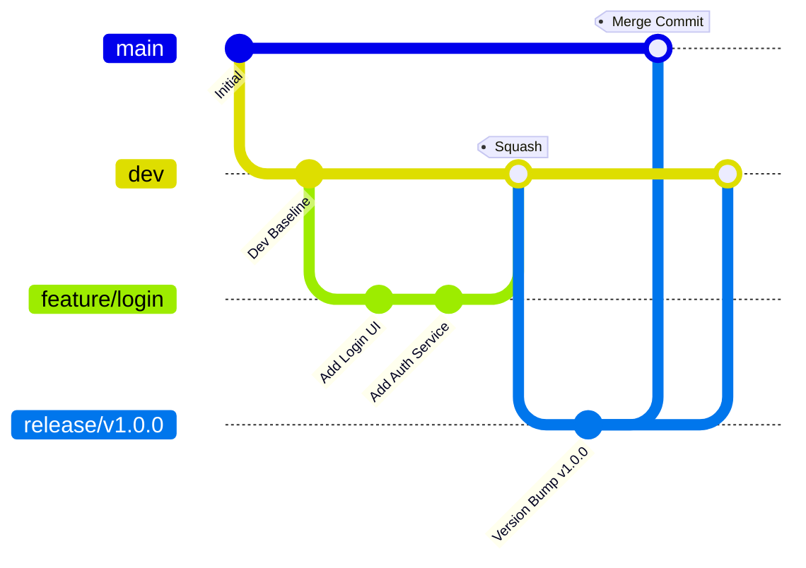

# Phase 2: GitFlow Implementation

GitFlow is a branching model that isolates feature development, releases, and hotfixes. This phase details how to set up, manage, and secure this workflow in Azure Repos.

---

## 1. Theory & Conceptual Architecture

### 1.1 Branch Lifecycle and Purpose
An enterprise GitFlow model comprises five primary branch types:

* **`main`**: The production-ready branch. It represents the live state of the application. No developer commits directly to `main`.
* **`dev`**: The integration branch. Features are merged here. It represents the latest development state.
* **`feature/*`**: Short-lived branches created from `dev`. Used to build specific user stories or bug fixes.
* **`release/*`**: Created from `dev` when preparing for a production release. Bug fixes found during QA/UAT are committed directly to this branch and merged back into `dev`.
* **`hotfix/*`**: Emergency branches created directly from `main` to address critical production issues. They are merged into both `main` and `dev`.

### 1.2 Merge Strategies Matrix
Choosing the right merge strategy controls your commit history.

| Merge Strategy | Commits History | Best Use Case |
| :--- | :--- | :--- |
| **Squash Merge** | Combines all commits from the source branch into a single commit. | Merging `feature/*` to `dev` (keeps history clean). |
| **Merge Commit (No-Fast-Forward)** | Keeps all source commits and creates a merge node. | Merging `release/*` or `hotfix/*` to `main`/`dev` (retains full integration context). |
| **Rebase and Merge** | Replays individual commits on top of the target branch. | Merging feature branch when a linear history is strictly required. |

---

## 2. GitFlow Architecture Diagram

Below is the workflow showing branches and merge pathways:



---

## 3. Azure DevOps UI Steps

### 3.1 Creating Branches in Azure Repos
1. Navigate to **Repos** -> **Branches** in Azure DevOps.
2. Click **New branch** (top right).
3. Name: `dev`, Based on: `main`. Click **Create**.

### 3.2 Setting Branch Policies (Branch Protection)
1. Go to **Repos** -> **Branches**.
2. Hover over the `main` branch, click the **three dots** icon on the right, and select **Branch policies**.
3. Toggle on **Require a minimum number of reviewers** (set to `1` or `2`). Check **Prohibit submitters from approving their own changes**.
4. Toggle on **Check for linked work items** (enforces tracing tasks to commits).
5. Toggle on **Check for comment resolution** (requires resolving all discussion threads before merging).
6. Toggle on **Limit merge types** and check **Basic merge (no-fast-forward)** only.
7. Click **+ Add status policy** or **Build validation** to link pipeline gates (configured in Phase 3).
8. Repeat these steps for the `dev` branch, but allow **Squash merge** as the permitted merge type.

---

## 4. Git Commands Workflow

### 4.1 Feature Development
Developers execute these commands to build and merge features:
```bash
# Pull the latest dev branch
git checkout dev
git pull origin dev

# Create feature branch
git checkout -b feature/jwt-auth

# Commit changes
echo "const jwt = require('jsonwebtoken');" > src/auth.js
git add src/auth.js
git commit -m "feat: implement JWT token generation"

# Push to Azure Repos
git push origin feature/jwt-auth
```

### 4.2 Cherry-Picking Approved Commits
In enterprise environments, Product Managers or Release Managers often "cherry-pick" specific approved commits from `dev` to populate a `release/*` branch:
```bash
# Create release branch from latest dev branch or main
git checkout -b release/v1.1.0

# Fetch all commits
git fetch origin

# Find specific commit hash from dev (e.g. abc123f) and apply it
git cherry-pick abc123f

# Resolve any merge conflicts, then push to remote
git push origin release/v1.1.0
```

---

## 5. Azure Resources Required
No additional cloud infrastructure is required for setting up GitFlow. This resides entirely in Azure DevOps.

---

## 6. Validation Steps
1. Attempt to run `git push origin main` directly from local machine. It should be blocked by Azure Repos:
   `Error: TFS.WebApi.Exception: TF402455: Pushes to this branch are not permitted.`
2. Create a Pull Request from `feature/jwt-auth` to `dev`. Verify that:
   * The PR UI prompts for reviewers.
   * Merging is blocked until at least one linked work item is attached.

---

## 7. Troubleshooting Steps
* **Merge Conflicts during Cherry-Pick**: If you see conflict warnings, open the files, choose the correct lines, run `git add <file>`, and execute `git cherry-pick --continue`.
* **Lost commit history**: If a developer squash merges a branch incorrectly, review the git reflog or use the Azure DevOps pull request history tab to locate the original commit IDs.

---

## 8. Interview Questions & Answers

1. **Why do we squash merge feature branches into `dev`?**
   * *Answer*: To prevent cluttering the shared integration branch with trivial intermediate commits (e.g. "fix typo", "test again").
2. **What is a branch policy in Azure DevOps?**
   * *Answer*: A rule set on a specific branch to enforce pull requests, code reviews, build validations, and comment resolution.
3. **What is the difference between a hotfix branch and a bugfix?**
   * *Answer*: A bugfix is planned work integrated into `dev`. A hotfix is an emergency fix created from `main` to repair production and immediately merged to both `main` and `dev`.
4. **How does cherry-pick work?**
   * *Answer*: It copies a specific commit from one branch and applies it to another, creating a new commit ID with identical file changes.
5. **How do you enforce work item linking in PRs?**
   * *Answer*: By enabling the "Check for linked work items" setting inside the Branch Policies UI of the target branch.
6. **Can you push directly to `main` if you are a Project Administrator?**
   * *Answer*: By default, no. Branch policies apply to everyone. However, administrators can bypass policies if they have explicit "Bypass policies when pushing" permission.
7. **What is a merge conflict?**
   * *Answer*: When two branches make changes to the same line in a file and Git cannot determine which version to keep automatically.
8. **Why do we prohibit submitters from approving their own PRs?**
   * *Answer*: To maintain security and compliance (e.g., SOC2), ensuring four-eyes principle review.
9. **What is the difference between fast-forward merge and no-fast-forward merge?**
   * *Answer*: Fast-forward moves the target branch pointer directly to the source commit without creating a merge node. No-fast-forward creates a dedicated merge commit, retaining branching history.
10. **When would you delete a feature branch?**
    * *Answer*: Immediately after it is successfully merged into `dev`.
11. **How do you keep your local feature branch up to date with `dev`?**
    * *Answer*: Run `git checkout dev`, `git pull`, then `git checkout feature/*` and `git merge dev`.
12. **How does GitFlow track release versions?**
    * *Answer*: By tagging the merge commit on the `main` branch with the version number (e.g., `v1.0.0`).
13. **What is a draft Pull Request?**
    * *Answer*: A work-in-progress pull request that cannot be merged until marked as "Ready for review".
14. **How do you undo an accidental merge?**
    * *Answer*: Use `git revert <merge-commit-hash>` to create a reverse commit that undoes the changes.
15. **What is the default naming convention for feature branches?**
    * *Answer*: `feature/[jira-ticket-id]-[short-description]` or `feature/[username]/[short-description]`.
16. **Why do we need a separate `release/*` branch?**
    * *Answer*: It allows QA to test and stabilize code in isolation while developers continue adding new features to `dev`.
17. **How does Azure DevOps handle comment resolution?**
    * *Answer*: Discussions must be marked as "Resolved" in the PR chat window before the merge button becomes active.
18. **Can you configure branch policies using code?**
    * *Answer*: Yes, policies can be managed using the Azure DevOps REST API, Azure CLI, or Terraform.
19. **What is the danger of cherry-picking commits?**
    * *Answer*: It duplicates changes under new commit hashes, which can lead to complex merge conflicts if those branches merge later.
20. **Who should review release branch changes?**
    * *Answer*: QA Leads, Product Owners, and Release Managers.

---

## 9. Real Industry Practices
* **Branch Lifetimes**: Feature branches should live no longer than 3–5 days to minimize conflict complexity.
* **Auto-Delete**: Check the "Delete source branch after merging" option in the Pull Request interface to prevent stale branch build-ups.

---

## 10. Production Best Practices
* **No Direct Merges**: Block all direct pushes to `main`, `dev`, and `release/*`.
* **Traceability**: Mandate linking each Pull Request to a work item or user story to satisfy compliance requirements.

---

## 11. Common Failure Scenarios
* **Conflict Loops**: Occurs when developers merge `dev` into `feature/*` repeatedly without resolving conflicts cleanly.
* **Orphan Commits**: Commits pushed directly to remote before branch policies are activated.
