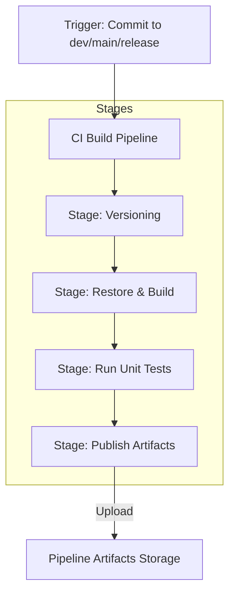

# Phase 5: Build Pipeline

This phase details how to construct a production-ready Continuous Integration (CI) build pipeline that compiles code, executes tests, generates coverage reports, applies semantic versioning, and publishes immutable artifacts.

---

## 1. Theory & Semantic Versioning

### 1.1 CI vs CD
* **Continuous Integration (CI)**: The practice of automating the compiling, testing, and packaging of application code whenever a developer pushes changes to a shared repository.
* **Continuous Delivery / Deployment (CD)**: The automated process of deploying compiled artifacts to testing, staging, and production environments.

### 1.2 Semantic Versioning (SemVer)
Semantic Versioning follows the template `MAJOR.MINOR.PATCH`:
* **MAJOR**: Incremented for incompatible API changes.
* **MINOR**: Incremented for adding functionality in a backwards-compatible manner.
* **PATCH**: Incremented for backwards-compatible bug fixes.

We use **GitVersion** to calculate these numbers dynamically based on Git tags and commit messages (e.g. including `+semver: minor` or `+semver: breaking` in commit comments).

### 1.3 Caching
Build pipelines download package dependencies repeatedly. To optimize speed and save network bandwidth, we use the **Cache** task. This saves dependency directories (e.g. `node_modules`, NuGet global cache) and restores them based on a hash of lock files (e.g. `package-lock.json`).

---

## 2. Architecture Diagram

Below is the compilation, testing, and packaging pipeline:



---

## 3. Configuration & YAML Implementation

### 3.1 GitVersion Configuration (`GitVersion.yml`)
Create this configuration file in your repository root to govern versioning logic:
```yaml
mode: Mainline
branches:
  main:
    regex: ^master$|^main$
    mode: ContinuousDelivery
    tag: ''
  dev:
    regex: ^dev$
    mode: ContinuousDeployment
    tag: alpha
```

### 3.2 Production-Grade Node.js Build Pipeline (`pipelines/build.yml`)
This pipeline compiles code, runs tests, creates a build cache, calculates versions, and publishes artifacts:
```yaml
trigger:
  branches:
    include:
    - main
    - dev
    - release/*

variables:
- name: NPM_CACHE_DIR
  value: $(Pipeline.Workspace)/.npm

pool:
  vmImage: 'ubuntu-latest'

stages:
- stage: CalculateVersion
  displayName: 'SemVer Calculation'
  jobs:
  - job: GitVersion
    displayName: 'Run GitVersion'
    steps:
    - checkout: self
      fetchDepth: 0 # Required for GitVersion to read git history
    - task: gitversion/setup@0
      inputs:
        versionSpec: '5.x'
    - task: gitversion/execute@0
      name: gitversion
      inputs:
        useConfigFile: true
        configFilePath: 'GitVersion.yml'
    # Expose version numbers to downstream stages
    - script: |
        echo "##vso[task.setvariable variable=SemVer;isOutput=true]$(GitVersion.SemVer)"
      name: setVersionStep

- stage: BuildAndTest
  displayName: 'Build and Unit Test'
  dependsOn: CalculateVersion
  variables:
    # Read version output from preceding stage
    SemVer: $[ stageDependencies.CalculateVersion.GitVersion.outputs['setVersionStep.SemVer'] ]
  jobs:
  - job: CompileAndRun
    displayName: 'Node.js Package & Test'
    steps:
    # 1. Restore npm dependency cache
    - task: Cache@2
      inputs:
        key: 'npm | "$(Agent.OS)" | package-lock.json'
        restoreKeys: |
          npm | "$(Agent.OS)"
        path: $(NPM_CACHE_DIR)
      displayName: 'Cache npm packages'

    - task: NodeTool@0
      inputs:
        versionSpec: '18.x'
      displayName: 'Install Node'

    - script: |
        npm ci --cache $(NPM_CACHE_DIR)
      displayName: 'Install Dependencies'

    - script: |
        npm run build --if-present
      displayName: 'Build Code'

    # Run tests and export JUnit reports
    - script: |
        npm test -- --reporters=default --reporters=jest-junit
      displayName: 'Execute Unit Tests'
      env:
        JEST_JUNIT_OUTPUT_DIR: $(System.DefaultWorkingDirectory)/test-results

    # 2. Publish JUnit Test Results
    - task: PublishTestResults@2
      inputs:
        testResultsFormat: 'JUnit'
        testResultsFiles: '$(System.DefaultWorkingDirectory)/test-results/*.xml'
        failTaskOnFailedTests: true
      displayName: 'Publish Unit Test Results'

    # 3. Publish Code Coverage Reports
    - task: PublishCodeCoverageResults@1
      inputs:
        codeCoverageTool: 'Cobertura'
        summaryFileLocation: '$(System.DefaultWorkingDirectory)/coverage/cobertura-coverage.xml'
      displayName: 'Publish Code Coverage Results'

    # 4. Package app with semantic version details
    - script: |
        echo "$(SemVer)" > dist/version.txt
        tar -czf $(Build.ArtifactStagingDirectory)/app-$(SemVer).tar.gz dist/
      displayName: 'Package Application Artifact'

    # 5. Upload artifact to pipeline storage
    - task: PublishPipelineArtifact@1
      inputs:
        targetPath: '$(Build.ArtifactStagingDirectory)'
        artifact: 'drop'
      displayName: 'Publish Drop Artifact'
```

---

## 4. Azure DevOps UI Steps

### 4.1 Creating the Build Pipeline
1. Navigate to **Pipelines** -> **Pipelines**. Click **New pipeline**.
2. Select **Azure Repos Git** -> `repo-payment-gateway`.
3. Select **Existing Azure Pipelines YAML file** and point to `/pipelines/build.yml`. Click **Continue**.
4. Click **Run** to execute the pipeline.

### 4.2 Restoring Dependencies Cache Verification
1. Navigate to your completed pipeline run summary page.
2. Click the **Post-job: Cache npm packages** task log. Look for messages stating:
   `Cache saved successfully` or `Resolved from Cache`.

---

## 5. Git Commands

Developers can tag versions manually or commit version flags:

```bash
# Tagging a release version manually
git tag v1.0.0
git push origin v1.0.0

# Adding SemVer instruction inside a commit message
git checkout -b feature/user-settings
echo "const settings = {};" > src/settings.js
git add src/settings.js
git commit -m "feat: user settings configuration +semver: minor"
git push origin feature/user-settings
```

---

## 6. Validation Steps
1. Review the build summary page. Verify that the **Tests** tab is visible, showing a summary of pass/fail counts.
2. Navigate to the **Artifacts** dropdown button on the top right of the run page. Verify that `drop/app-[version].tar.gz` exists.

---

## 7. Troubleshooting Steps
* **GitVersion fails to run**: Ensure the pipeline checkouts the repository with **Fetch Depth = 0** (`fetchDepth: 0` under checkout settings). GitVersion requires complete git commits history to calculate relative tags.
* **Cache miss**: If the Cache task repeatedly reports a cache miss, ensure the cached directory path matches the directory npm downloads packages to.

---

## 8. Interview Questions & Answers

1. **What is the difference between PublishBuildArtifacts and PublishPipelineArtifact?**
   * *Answer*: `PublishPipelineArtifact` is newer, uses smart deduplication, runs faster, and is highly optimized. `PublishBuildArtifacts` is legacy.
2. **Explain how SemVer works.**
   * *Answer*: It uses a 3-part version number (Major.Minor.Patch) to denote breaking changes, features, and bug fixes respectively.
3. **What is GitVersion?**
   * *Answer*: A tool that reads Git history, tags, and commits to determine semantic versions dynamically.
4. **How do you publish unit test results in Azure DevOps?**
   * *Answer*: Using the `PublishTestResults@2` task, pointing to XML reports generated by Jest, JUnit, NUnit, or MSTest.
5. **How does pipeline caching work?**
   * *Answer*: The `Cache@2` task uploads a specified directory to cloud storage using a unique key. If a matching key is found on subsequent runs, it downloads and extracts the directory, bypassing installations.
6. **Why do we require fetchDepth: 0 for versioning?**
   * *Answer*: By default, pipelines perform shallow clones (depth 1) to save time. Versioning tools need full history to locate tagging parent commits.
7. **What is a build matrix?**
   * *Answer*: A configuration allowing a single job definition to run multiple times in parallel across different OS or runtime versions.
8. **What is the difference between a CI build and a PR build?**
   * *Answer*: A PR build runs on a temporary merge commit to validate merge safety. A CI build runs after the code has been merged.
9. **How do you generate code coverage?**
   * *Answer*: Configure your testing tool (e.g. Jest, Istanbul) to output reports in standard formats like Cobertura or LCOV, then upload them via `PublishCodeCoverageResults@1`.
10. **What is JUnit format?**
    * *Answer*: A standard XML schema used by test runners to describe execution results (pass, fail, skip, runtime).
11. **How does Azure DevOps handle failed tests?**
    * *Answer*: By setting `failTaskOnFailedTests: true` in the results publisher task, which marks the pipeline stage as failed.
12. **Can you reuse variables across different stages?**
    * *Answer*: Yes, by declaring dependencies and referencing the variable using `$[ stageDependencies.StageName.JobName.outputs['StepName.VarName'] ]` syntax.
13. **What is $(Build.ArtifactStagingDirectory)?**
    * *Answer*: A local directory path on the agent where files are copied before being published to pipeline artifacts storage.
14. **Why are pipeline caches immutable?**
    * *Answer*: Once a cache is uploaded, it cannot be modified. If dependencies change, the cache key must change (e.g., via a new hash of `package-lock.json`) to trigger a new cache creation.
15. **What is `npm ci`?**
    * *Answer*: Clean Install. It deletes `node_modules` and reinstalls packages directly from `package-lock.json` without updating them.
16. **How do you customize build numbers?**
    * *Answer*: By adding `name: $(Date:yyyyMMdd).$(Rev:r)` at the top of your YAML pipeline.
17. **What are upstream sources in package feeds?**
    * *Answer*: Connections to public registries (like npmjs.org) that cache downloaded packages inside your private feed.
18. **What is the difference between hosted and self-hosted build environments?**
    * *Answer*: Hosted builds run on ephemeral VMs managed by Microsoft. Self-hosted builds run on systems you manage, offering custom software and faster local caching.
19. **How do you secure artifacts?**
    * *Answer*: Limit artifact feed permissions and restrict download access to authorized pipeline service accounts.
20. **What is Jest-JUnit?**
    * *Answer*: A Jest reporter that translates JavaScript test run outcomes into JUnit XML files.

---

## 9. Real Industry Practices
* **Branch-Based Versioning**: Append branch metadata tags (e.g., `-alpha` on dev, `-rc` on release/*) to versions prior to final production release tags.
* **Auto-Trigger Build**: Trigger builds automatically on merge commits to prevent untested code from lingering in branch targets.

---

## 10. Production Best Practices
* **Fast Feedback**: Keep compilation and testing stages under 10 minutes by leveraging cache structures and running test suites in parallel.
* **Traceable Versions**: Bake Git commit SHAs directly into build metadata files inside the published archive.

---

## 11. Common Failure Scenarios
* **Cache Key Collision**: Running builds on different OS targets using the same cache key template, causing binaries mismatch. Add `$(Agent.OS)` to cache keys to avoid this.
* **Missing Fetch Depth**: GitVersion failing because it runs in a shallow clone environment.
