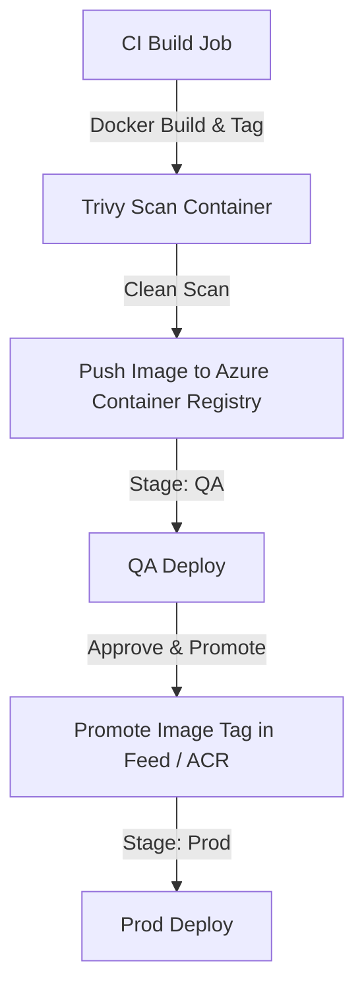

# Phase 6: Artifact Management

This phase details how to store, secure, tag, and promote deployable packages using Azure Artifacts and Azure Container Registry (ACR) in a cost-effective manner.

---

## 1. Theory & Best Practices

### 1.1 Package Management in Azure DevOps
* **Azure Artifacts**: A fully managed package repository service supporting npm, NuGet, Maven, PyPI, and Universal Packages.
* **Feed Scopes**:
  * **Project-scoped**: Visible only within the host project. Preferred for enterprise isolation.
  * **Organization-scoped**: Accessible by any project inside the Azure DevOps organization.
* **Upstream Sources**: Allows proxying external registries (like npmjs.org). Packages downloaded from upstream are cached in the feed, protecting builds from external downtime.

### 1.2 Azure Container Registry (ACR)
ACR is a private Docker registry hosted in Azure.
* **Tiers**: Basic (best for student subscription to save cost), Standard, and Premium (adds geo-replication).
* **Immutable Artifacts**: The practice of blocking overwriting of tags. For example, once `app:1.0.0` is pushed, it cannot be overwritten. This prevents deploying unvalidated changes disguised as an existing version.

### 1.3 Artifact Promotion Strategy
Instead of rebuilding code for each environment, we build the package once, publish it, and "promote" it. This guarantees that the exact bytes tested in QA are deployed to Production.

---

## 2. Architecture Diagram

Below is the artifact storage and promotion workflow:



---

## 3. Azure DevOps UI Steps

### 3.1 Creating an Azure Artifacts Feed
1. Open Azure DevOps. Navigate to **Artifacts** in the left menu.
2. Click **+ Create Feed** (top center).
3. Name: `feed-enterprise-core`. Visibility: **Project-scoped** (select `prj-fin-corebanking`).
4. Keep **Include packages from common public sources** checked (sets up upstream sources).
5. Click **Create**.

### 3.2 Setting up Azure Container Registry (Basic Tier)
1. Log in to the Azure Portal (`https://portal.azure.com`).
2. Search for **Container registries**. Click **Create**.
3. Resource Group: `rg-devops-platform`. Registry name: `acrenterprisecore` (must be globally unique and alphanumeric).
4. Region: `East US`. SKU: **Basic** (cost-optimized).
5. Click **Review + create**, then click **Create**.
6. Once deployed, open the registry, go to the **Access keys** menu, and enable **Admin user** (required for simple logins, though managed identities are preferred for production).

---

## 4. Complete Pipeline YAML (Build, Scan, & Push Docker)

This pipeline builds a Docker image, runs a Trivy vulnerability scan on it, and pushes it to ACR:

```yaml
trigger:
  branches:
    include:
    - main
    - release/*

variables:
- group: vg-shared-config
- name: dockerRegistryServiceConnection
  value: 'sc-azure-acr-dev' # Service Connection Name to ACR
- name: imageRepository
  value: 'core-banking-app'
- name: containerRegistry
  value: 'acrenterprisecore.azurecr.io'
- name: dockerfilePath
  value: '$(Build.SourcesDirectory)/Dockerfile'
- name: tag
  value: '$(Build.BuildId)'

pool:
  vmImage: 'ubuntu-latest'

stages:
- stage: BuildAndScan
  displayName: 'Docker Compile & Security Audit'
  jobs:
  - job: DockerBuild
    displayName: 'Build Container & Run Trivy'
    steps:
    # 1. Build local container image
    - task: Docker@2
      inputs:
        command: 'build'
        repository: '$(imageRepository)'
        dockerfile: '$(dockerfilePath)'
        tags: |
          $(tag)
      displayName: 'Build Docker Image'

    # 2. Run Trivy filesystem scan on the image
    - script: |
        # Install Trivy
        sudo apt-get install wget apt-transport-https gnupg lsb-release -y
        wget -qO - https://aquasecurity.github.io/trivy-repo/deb/public.key | gpg --dearmor | sudo tee /usr/share/keyrings/trivy.gpg > /dev/null
        echo "deb [signed-by=/usr/share/keyrings/trivy.gpg] https://aquasecurity.github.io/trivy-repo/deb $(lsb_release -sc) main" | sudo tee /etc/apt/sources.list.d/trivy.list
        sudo apt-get update
        sudo apt-get install trivy -y
        
        # Scan image for High and Critical vulnerabilities
        trivy image --severity HIGH,CRITICAL --exit-code 1 $(imageRepository):$(tag)
      displayName: 'Trivy Image Scan'

    # 3. Log in to ACR and push image (only if scan passes)
    - task: Docker@2
      inputs:
        containerRegistry: '$(dockerRegistryServiceConnection)'
        repository: '$(imageRepository)'
        command: 'push'
        tags: |
          $(tag)
      displayName: 'Push Image to ACR'
```

---

## 5. Azure Resources Required
* **Azure Container Registry (ACR)**: `acrenterprisecore` (Basic SKU) - (~$5/month, cheapest option).

---

## 6. Git Commands

Prepare your codebase with a basic Dockerfile to compile:

```bash
# Create a basic production-ready Dockerfile
cat <<EOT > Dockerfile
FROM node:18-alpine
WORKDIR /app
COPY package*.json ./
RUN npm ci --only=production
COPY src/ ./src/
EXPOSE 3000
CMD ["node", "src/app.js"]
EOT

# Commit and push
git checkout -b feature/docker-setup
git add Dockerfile
git commit -m "ci: add Dockerfile configuration"
git push origin feature/docker-setup
```

---

## 7. Validation Steps
1. Navigate to **Container registries** -> `acrenterprisecore` -> **Repositories** in the Azure Portal. Confirm `core-banking-app` exists.
2. Under Azure DevOps Artifacts, confirm that your feed is active and caching npm dependencies inside upstream sources.

---

## 8. Troubleshooting Steps
* **Trivy task fails with exit code 1**: Check the build console logs. Trivy prints the CVE identifiers causing the block. Update your base Docker image (e.g. use `node:18-alpine3.18` instead of plain `node:18-alpine`) to resolve system vulnerabilities.
* **ACR Push Unauthorized**: Ensure the Service Connection (`sc-azure-acr-dev`) has `AcrPush` role permissions on the container registry.

---

## 9. Interview Questions & Answers

1. **What is an immutable artifact?**
   * *Answer*: An artifact that cannot be overwritten or modified once published. In ACR, this is configured using tag locking.
2. **What is the difference between project-scoped and organization-scoped feeds?**
   * *Answer*: Project-scoped feeds are bound to a single project, simplifying isolation. Org-scoped feeds are shared globally.
3. **What is Trivy?**
   * *Answer*: An open-source security scanner that searches for vulnerabilities in container images, file systems, and Git repositories.
4. **Why do we use package lock files (e.g., package-lock.json)?**
   * *Answer*: To guarantee that downstream pipeline builds download the exact same package versions used during local development.
5. **How does an upstream source protect against package deletion (like the left-pad incident)?**
   * *Answer*: Once a package is fetched via an upstream source, a copy is cached in your private feed. If the package is deleted from the public registry, your build still pulls from the local feed cache.
6. **What role permissions are needed to push to ACR?**
   * *Answer*: The `AcrPush` role.
7. **What is a Universal Package?**
   * *Answer*: A package type in Azure Artifacts designed to store binaries, files, or non-standard codebases that don't fit npm/nuget patterns.
8. **How do you set a retention policy on Azure Artifacts?**
   * *Answer*: In Feed Settings, set the maximum number of versions per package to retain. Older versions are automatically deleted.
9. **Explain how to authenticate a local developer machine with Azure Artifacts.**
   * *Answer*: Install the `vsts-npm-auth` helper and configure the project `.npmrc` file with the feed endpoint credentials.
10. **Why should you avoid using the `latest` tag in production releases?**
    * *Answer*: The `latest` tag is mutable. Overwriting it makes rollbacks difficult and reduces deployment traceability.
11. **What is the default port for Docker registry traffic?**
    * *Answer*: HTTPS (443).
12. **Can Trivy check configuration files like Kubernetes YAML or Terraform?**
    * *Answer*: Yes, Trivy supports scanning misconfigurations in IaC templates.
13. **How does image caching work in Docker builds?**
    * *Answer*: Docker uses intermediate layers. If a layer's contents have not changed, it pulls from cache, speeding up builds.
14. **What is the purpose of multi-stage Docker builds?**
    * *Answer*: To compile binaries in a heavier build container and copy only the compiled outputs to a slim runtime image, minimizing image size and vulnerabilities.
15. **How do you delete a package version from Azure Artifacts?**
    * *Answer*: Go to the feed portal, select the version, and click **Delete** or **Deprecate**.
16. **Why do we use container registry credentials in service connections rather than secrets?**
    * *Answer*: Azure DevOps manages service connection authentication natively using Service Principals/OIDC.
17. **What is ACR Tasks?**
    * *Answer*: An ACR feature that automates building, testing, and patching container images in Azure.
18. **How does a developer access private packages in a pipeline?**
    * *Answer*: Ensure the pipeline build service account has "Reader" permissions on the target feed.
19. **What is package promotion?**
    * *Answer*: Moving a package release state (e.g. from Prerelease to Release view) to signify validation.
20. **What is the size limit for Universal Packages?**
    * *Answer*: Up to 4 Terabytes.

---

## 10. Real Industry Practices
* **No Immutable Tag Overwriting**: Configure ACR registry policy to enforce tag immutability.
* **Scan before Push**: Always execute Trivy scans on local image builds prior to pushing to remote registries.

---

## 11. Production Best Practices
* **Clean Registry**: Run ACR repository cleanup scripts or set retention tasks to prune untagged images regularly.
* **Basic SKU for Dev/Test**: Use the Basic ACR SKU to save costs, and upgrade to Premium only when multi-region replication is required.

---

## 12. Common Failure Scenarios
* **Registry Disk Space Quota**: Reaching storage thresholds on basic registries.
* **Trivy Database Out-of-Memory**: Occurs on small runner VMs. Run Trivy with the `--light` database flag to conserve memory.
