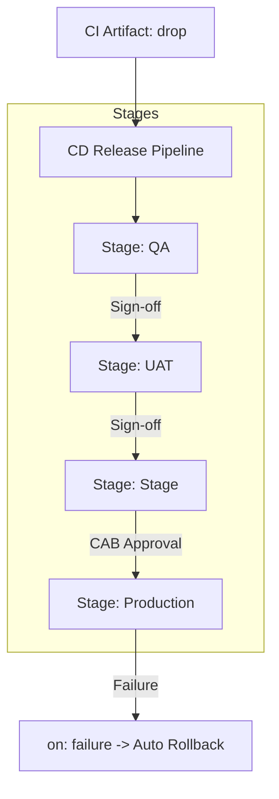

# Phase 8: Release Pipeline

This phase details how to design a multi-stage continuous delivery (CD) pipeline using YAML deployment jobs, environment gates, rollback routines, and secrets injection.

---

## 1. Theory & Design

### 1.1 Deployment Jobs vs Regular Jobs
* **Regular Job**: Compiles or tests code. It does not track environment states.
* **Deployment Job**: A specialized job step designed for deploying software. It supports lifecycle hooks (`preDeploy`, `deploy`, `routeTraffic`, `postRouteTraffic`, `on: failure`, `on: success`) and maps directly to Azure DevOps Environments to log audit history.

### 1.2 Deployment Strategies
* **runOnce**: Deploys changes once to all target VM resources in the environment.
* **rolling**: Deploys changes to a subset of VMs (e.g. 20% at a time) to reduce downtime.
* **canary**: Deploys changes to a tiny percentage of users (e.g. 10%) first. If no errors spike, the change is rolled out to the remaining nodes.

### 1.3 Rollback Strategies
* **Automatic Rollback**: If a deployment fails (`on: failure` block is triggered), the pipeline automatically runs a script or triggers a rollback task to redeploy the last stable version.
* **Manual Rollback**: A release manager redeploys a previous successful pipeline run directly from the run dashboard.

---

## 2. Release Pipeline Architecture Diagram

Below is the multi-stage environment promotion lifecycle:



---

## 3. Complete Production-Grade Release Pipeline YAML

Save this file as `pipelines/cd-release.yml`. It defines multi-stage deployment with variable injections and rollback hooks:

```yaml
trigger: none

resources:
  pipelines:
  - pipeline: ci-build
    source: CI-Build # Name of the build pipeline in Azure DevOps
    trigger:
      branches:
      - main
      - release/*

variables:
- group: vg-shared-config

stages:
# 1. QA Stage
- stage: DeployToQA
  displayName: 'Deploy QA Environment'
  variables:
  - name: ENV_URL
    value: 'app-qa.azurewebsites.net'
  jobs:
  - deployment: DeployQA
    environment: 'env-qa'
    strategy:
      runOnce:
        deploy:
          steps:
          - script: |
              echo "Deploying application artifact to QA server..."
              echo "Target environment URL: $(ENV_URL)"
            displayName: 'Deploy Application'

# 2. UAT Stage
- stage: DeployToUAT
  displayName: 'Deploy UAT Environment'
  dependsOn: DeployToQA
  variables:
  - name: ENV_URL
    value: 'app-uat.azurewebsites.net'
  jobs:
  - deployment: DeployUAT
    environment: 'env-uat'
    strategy:
      runOnce:
        deploy:
          steps:
          - script: |
              echo "Deploying to UAT environment..."
            displayName: 'Deploy Application'

# 3. Production Stage with Rollback
- stage: DeployToProd
  displayName: 'Deploy Production Environment'
  dependsOn: DeployToUAT
  variables:
  - name: ENV_URL
    value: 'app-prod.azurewebsites.net'
  jobs:
  - deployment: DeployProd
    environment: 'env-prod'
    strategy:
      runOnce:
        deploy:
          steps:
          - script: |
              echo "Deploying application to active Production target..."
              # Simulating deployment logic (e.g. CLI deployment)
            displayName: 'Deploy Production Application'
        
        # Automatic Rollback Hook
        routeTraffic:
          steps:
          - script: |
              echo "Running health checks on active slots..."
            displayName: 'Validate Active Traffic'
            
        on:
          failure:
            steps:
            - script: |
                echo "WARNING: Production deployment failed. Initiating automatic rollback..."
                # Run script to point traffic back to previous stable release slot
              displayName: 'Execute Rollback Routine'
```

---

## 4. Azure DevOps UI Steps

### 4.1 Creating the Release Pipeline
1. Navigate to **Pipelines** -> **Pipelines**. Click **New pipeline**.
2. Select **Azure Repos Git** -> `repo-payment-gateway`.
3. Select **Existing Azure Pipelines YAML file** -> `/pipelines/cd-release.yml`. Click **Continue**.
4. Click **Save**.

### 4.2 Linking Key Vault to Variable Groups (Security Guardrails)
1. Ensure your Azure Key Vault exists (created in Azure Portal).
2. Go to **Project Settings** -> **Service connections** and verify your connection exists.
3. Open **Pipelines** -> **Library**. Click **+ Variable group**.
4. Name: `vg-prod-secrets`.
5. Toggle on **Link secrets from an Azure key vault as variables**.
6. Select your service connection and Key Vault name.
7. Click **+ Add** to select the secrets you want to import (e.g., database passwords). Click **Save**.

---

## 5. Git Commands

Commit and test the release pipeline:

```bash
# Push release YAML
git checkout -b feature/release-pipeline
git add pipelines/cd-release.yml
git commit -m "ci: add multi-stage CD pipeline template"
git push origin feature/release-pipeline
```

---

## 6. Validation Steps
1. Run the `CI-Build` pipeline to generate a fresh artifact.
2. Verify that the `CD-Release` pipeline triggers automatically upon completion of the build pipeline run.
3. Verify that variables are injected correctly for each environment by checking the deployment logs.

---

## 7. Troubleshooting Steps
* **Pipeline not triggering on build completion**: Ensure the pipeline resource trigger block in the YAML matches the spelling of your build pipeline definition in Azure DevOps exactly.
* **Key Vault access denied**: Ensure the Service Principal used by your Service Connection has **Get** and **List** secrets access policies configured inside the Key Vault's Access Policies or Azure RBAC settings.

---

## 8. Interview Questions & Answers

1. **What is a deployment job lifecycle hook?**
   * *Answer*: Predefined steps inside a deployment strategy (`preDeploy`, `deploy`, `routeTraffic`, `postRouteTraffic`, `on: failure`, `on: success`) used to structure updates and rollbacks.
2. **What is the difference between rolling and canary deployments?**
   * *Answer*: Rolling updates target VMs in batches. Canary deploys to a small user group first to test quality before updating all instances.
3. **What is `dependsOn` used for in multi-stage pipelines?**
   * *Answer*: It forces stages to execute in sequence instead of running in parallel (e.g. UAT runs only after QA completes).
4. **How do you reference Key Vault secrets in variable groups?**
   * *Answer*: Toggle the "Link secrets from an Azure key vault" switch inside the Variable Group Library settings.
5. **How does the `on: failure` hook assist in rollbacks?**
   * *Answer*: It intercepts execution if any previous deployment step fails, triggering rollback scripts automatically.
6. **Explain pipeline resources triggers.**
   * *Answer*: Setting the pipeline to run automatically when another upstream build pipeline run finishes successfully.
7. **What is the runOnce deployment strategy?**
   * *Answer*: The simplest deployment strategy. It executes the deployment steps once on all target resources.
8. **How does Azure DevOps prevent secret leakage in release logs?**
   * *Answer*: It intercepts and replaces any text strings matching defined secrets with `***`.
9. **Can you inject variables on a per-stage basis?**
   * *Answer*: Yes, by defining the `variables` property block directly inside the target `stage:` block.
10. **What is the purpose of release gates?**
    * *Answer*: Automated checks (like monitoring alerts or REST APIs) that validate application stability before promoting code to the next environment.
11. **How do you trigger a rollback manually?**
    * *Answer*: Locate the last known working pipeline run, select the deploy job, and click "Redeploy".
12. **What is the role of a Release Manager in GitFlow?**
    * *Answer*: To coordinate branch cut-offs, approve production change requests, and verify environment health.
13. **Can a deployment job run on hosted agents?**
    * *Answer*: Yes. They can target both hosted VM images and self-hosted runners.
14. **How do you limit a stage deployment to only specific branches?**
    * *Answer*: By using condition expressions, for example: `condition: and(succeeded(), eq(variables['Build.SourceBranch'], 'refs/heads/main'))`.
15. **What is a variable group?**
    * *Answer*: A shared container for configuration settings and secrets accessible across multiple pipelines.
16. **How do you schedule deployments?**
    * *Answer*: Using cron triggers (`schedules:`) at the top of the YAML file.
17. **What happens if a Key Vault secret expires?**
    * *Answer*: The pipeline will fail to resolve the variable group during initialization, aborting the run.
18. **Can you download artifacts from different projects?**
    * *Answer*: Yes, by defining the project name parameter inside the download task or pipeline resource block.
19. **What is the difference between a trigger and a resource?**
    * *Answer*: A trigger starts the pipeline. A resource is an external component (another pipeline, container image, repository) that the pipeline depends on.
20. **Why should database migrations run in a preDeploy stage?**
    * *Answer*: To ensure that the database schema is updated before the new application code starts receiving traffic.

---

## 9. Real Industry Practices
* **Zero Downtime**: Always use rolling or slot-swap strategies for production releases to eliminate user downtime.
* **Auto-Rollback Tests**: Include automated health tests in the postRouteTraffic step. If they fail, trigger a rollback immediately.

---

## 10. Production Best Practices
* **Scoped Key Vaults**: Maintain isolated Key Vault instances for development/QA and production to avoid permission crossings.
* **Clean Artifact Downloads**: Download only required artifact sub-folders using the `download` keyword to optimize execution speeds.

---

## 11. Common Failure Scenarios
* **Missing Secret Permissions**: The pipeline crashes because the service connection account lacks access to the Key Vault.
* **Orphaned Migrations**: Deployment fails, but database migrations were already executed, leaving the database in an inconsistent state. Write backward-compatible database schemas.
