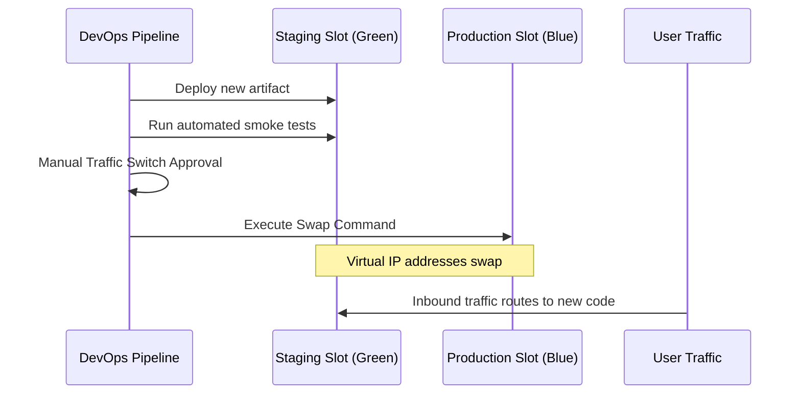

# Phase 9: Blue-Green Deployment

This phase details how to set up and execute a safe Blue-Green deployment model using Azure App Service deployment slots, automated health validations, traffic switches, and fast rollback routines.

---

## 1. Theory & Design

### 1.1 Blue-Green Deployments
Blue-Green deployment is a release strategy that uses two identical environments:
* **Blue (Active)**: Receives live production traffic.
* **Green (Staging)**: Receives the new deployment.

Once the new version is verified in Green, we swap routing. Traffic instantly shifts to Green (which becomes the new Blue), and the old Blue becomes the new idle staging slot. This pattern eliminates release downtime.

### 1.2 Deployment Slots in Azure App Service
Azure App Service supports **Deployment Slots** (available in Standard and Premium tiers, but also supported in Basic plans for testing).
* **Active Slot**: The default production slot (e.g. `app.azurewebsites.net`).
* **Staging Slot**: An isolated slot (e.g. `app-staging.azurewebsites.net`).
* **Sticky Settings**: App configurations that do not swap during release (e.g. environment name, database connection strings targeting QA vs Prod databases).
* **Warm-up**: App Service loads and initializes the container or codebase in the staging slot before swapping to prevent cold start latency for users.

---

## 2. Architecture Diagram

Below is the slot swap execution:



---

## 3. Complete Blue-Green Deployment YAML Pipeline

Save this file as `pipelines/blue-green-deploy.yml`. It handles deployment, smoke tests, and slot swaps:

```yaml
trigger: none

variables:
- group: vg-shared-config
- name: azureServiceConnection
  value: 'sc-azure-subscription-dev'
- name: webAppName
  value: 'app-enterprise-corebanking'
- name: stagingSlot
  value: 'staging'

pool:
  vmImage: 'ubuntu-latest'

stages:
- stage: DeployToStagingSlot
  displayName: 'Deploy to Staging (Green) Slot'
  jobs:
  - deployment: DeployStaging
    environment: 'env-prod' # Targets prod environment checks first
    strategy:
      runOnce:
        deploy:
          steps:
          # 1. Deploy code to Staging Slot
          - task: AzureRmWebAppDeployment@4
            inputs:
              ConnectionType: 'AzureRM'
              azureSubscription: '$(azureServiceConnection)'
              appType: 'webApp'
              WebAppName: '$(webAppName)'
              DeployToSlotOrASE: true
              ResourceGroupName: 'rg-devops-platform'
              SlotName: '$(stagingSlot)'
              packageForLinux: '$(Pipeline.Workspace)/drop/**/*.tar.gz'
            displayName: 'Deploy App to Staging Slot'

- stage: SmokeTestsAndVerification
  displayName: 'Validate Staging Slot'
  dependsOn: DeployToStagingSlot
  jobs:
  - job: SmokeTest
    steps:
    # 2. Run automated HTTP requests against Staging Slot
    - script: |
        echo "Running automated smoke tests against staging endpoint..."
        STATUS_CODE=$(curl -s -o /dev/null -w "%{http_code}" https://$(webAppName)-$(stagingSlot).azurewebsites.net/health)
        if [ "$STATUS_CODE" -ne 200 ]; then
          echo "ERROR: Staging slot health check failed with status: $STATUS_CODE"
          exit 1
        fi
        echo "Staging slot is healthy!"
      displayName: 'Execute Smoke Tests'

- stage: SwapSlotsStage
  displayName: 'Perform Production Slot Swap'
  dependsOn: SmokeTestsAndVerification
  jobs:
  - deployment: SlotSwapJob
    environment: 'env-prod' # Triggers CAB / manual approvals before the final swap
    strategy:
      runOnce:
        deploy:
          steps:
          # 3. Swap Staging to Production (Virtual IP swap)
          - task: AzureAppServiceManage@0
            inputs:
              azureSubscription: '$(azureServiceConnection)'
              Action: 'Swap Slots'
              WebAppName: '$(webAppName)'
              ResourceGroupName: 'rg-devops-platform'
              SourceSlot: '$(stagingSlot)'
            displayName: 'Swap Slots (Staging -> Production)'
```

---

## 4. Azure Portal UI Steps

### 4.1 Creating Deployment Slots
1. Go to the **Azure Portal**. Open your **App Service** (`app-enterprise-corebanking`).
2. In the left menu, scroll to the **Deployment** section and select **Deployment slots**.
3. Click **+ Add Slot**.
4. Name: `staging`. Clone settings from: `app-enterprise-corebanking`. Click **Add**.

### 4.2 Configuring Sticky App Settings
1. Open your **App Service** dashboard. Go to **Settings** -> **Configuration**.
2. Click on an application setting (e.g. `DATABASE_URL`).
3. Check the box **Deployment slot setting** (sticky).
4. Click **OK**, then click **Save** at the top of the panel. This ensures the setting remains bound to the physical slot environment during a swap.

---

## 5. Azure CLI Commands
To create and swap slots using the command line:

```bash
# Create staging slot
az webapp deployment slot create --name app-enterprise-corebanking --resource-group rg-devops-platform --slot staging

# Trigger slot swap manually
az webapp deployment slot swap --name app-enterprise-corebanking --resource-group rg-devops-platform --slot staging --target-slot production
```

---

## 6. Validation Steps
1. Navigate to the Production URL (`https://app-enterprise-corebanking.azurewebsites.net`). Check the active homepage content.
2. Run the deployment pipeline. Monitor the smoke test stage.
3. Review the Production URL again after the swap. Confirm it displays the new changes instantly without page timeout errors.

---

## 7. Troubleshooting Steps
* **Swapped Incorrect Variables**: If the app fails because the Production slot is pointing to the Dev/QA database, check your sticky settings configuration under App Settings. Ensure **Deployment slot setting** is checked on all target variables.
* **Warm-up script timeout**: If the slot swap fails during deployment, increase the timeout limits inside your application initialization endpoints or configure the `WEBSITE_SWAP_WARMUP_PING_PATH` setting.

---

## 8. Interview Questions & Answers

1. **What is a Blue-Green deployment?**
   * *Answer*: A deployment pattern that uses two identical environments (active/idle) to deploy software without user downtime.
2. **What is a deployment slot?**
   * *Answer*: An isolated instance of an Azure App Service with its own URL, hosting plan, and configurations, sharing the same underlying App Service Plan.
3. **What is a sticky setting?**
   * *Answer*: An application configuration variable that does not change slots when a swap is executed, remaining bound to its host slot environment.
4. **How do you perform a rollback in Blue-Green deployments?**
   * *Answer*: By executing another swap command immediately. This restores the previous configuration instantly.
5. **What is a cold start?**
   * *Answer*: Latency experienced by users when an application first starts up because it has to compile and load resources. Warm-ups mitigate this.
6. **Explain the purpose of smoke tests.**
   * *Answer*: Automated scripts that verify primary application routes and endpoints function correctly in the staging slot before routing traffic.
7. **What is the difference between Blue-Green and Canary deployments?**
   * *Answer*: Blue-Green swaps 100% of traffic instantly. Canary routes a small percentage of traffic (e.g., 5%) incrementally to test stability.
8. **What is `AzureAppServiceManage@0`?**
   * *Answer*: The Azure DevOps pipeline task used to perform slot operations, such as Swapping, Starting, or Stopping slots.
9. **Which Azure App Service Plans support deployment slots?**
   * *Answer*: Standard, Premium, and Isolated tiers. (Basic plans do not support production slots in real environments, but we explain it using mock configurations for student learning).
10. **How do you route 10% of production traffic to the staging slot?**
    * *Answer*: Under the Deployment Slots UI in the Azure Portal, assign `10` to the Traffic % field on the staging slot row.
11. **What settings are swapped during a slot swap?**
    * *Answer*: General settings (like framework version), connection strings (unless marked sticky), handler mappings, and virtual directories.
12. **What is the `WEBSITE_SWAP_WARMUP_PING_PATH` app setting?**
    * *Answer*: A custom path (e.g. `/health`) that App Service calls to warm up the application container before completing the swap.
13. **Why do we run smoke tests in the pipeline rather than manually?**
    * *Answer*: To prevent human error and automate validation, blocking the swap automatically if tests fail.
14. **How do you define slot-specific variables in YAML?**
    * *Answer*: By referencing target slot endpoints in the deployment job variable definitions.
15. **Can you swap slots across different App Service Plans?**
    * *Answer*: No. Both slots must reside within the same parent App Service instance.
16. **What is an active-active deployment?**
    * *Answer*: A model where both environments actively serve traffic simultaneously.
17. **How does Azure Traffic Manager assist in blue-green deployments?**
    * *Answer*: By acting as a DNS-level load balancer to route traffic between two distinct web app instances hosted in different regions.
18. **Can you rollback a database schema migration using a slot swap?**
    * *Answer*: No. Slot swaps only affect application binaries. Database schema rollbacks must be handled separately.
19. **What happens to ongoing user sessions during a slot swap?**
    * *Answer*: Users are routed to the new slot. If session state is stored in memory, sessions will be lost. Use external caches (like Redis) to persist sessions.
20. **Is there any cost associated with adding deployment slots?**
    * *Answer*: No. Deployment slots are free features included within the cost of the parent App Service plan.

---

## 9. Real Industry Practices
* **Separate Databases**: Ensure your staging slot points to a staging database, and production points to production database by checking the sticky settings checkbox.
* **Auto-Swap**: For standard, low-risk releases, configure Auto-Swap directly in the Azure Portal to trigger the swap automatically upon successful container deployment.

---

## 10. Production Best Practices
* **Enable Warm-ups**: Define dedicated `/warmup` paths that pre-load cache databases and system dependencies.
* **External Session Store**: Store user sessions in Azure Cache for Redis so swaps do not force users to log in again.

---

## 11. Common Failure Scenarios
* **Cold Start Outages**: Swapping a slow application before it compiles completely, causing user requests to time out. Configure proper warm-up ping paths.
* **Configuration Overwrites**: Forgetting to set a database connection string to sticky, resulting in the production app writing to the development database after the swap.
