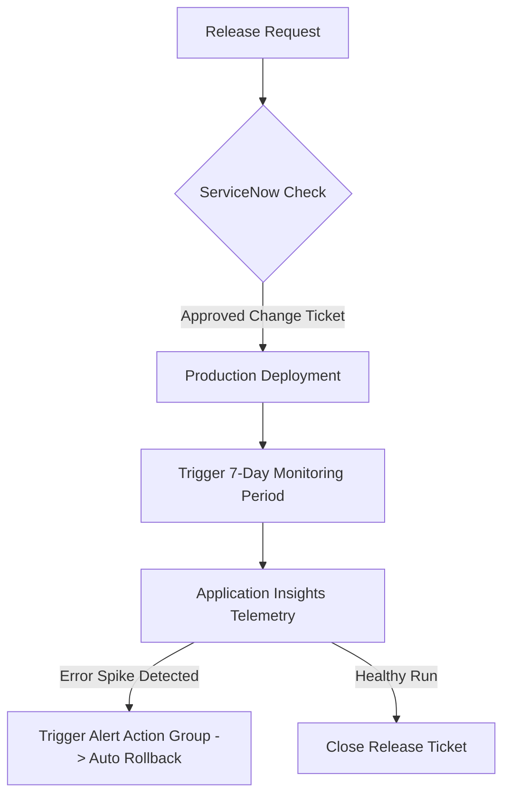

# Phase 10: Production Governance

This phase details how to enforce release governance, change management, and production observability using Azure Monitor, Application Insights, Log Analytics, and Kusto Query Language (KQL).

---

## 1. Theory & Governance

### 1.1 Change Management & CAB
* **CAB (Change Advisory Board)**: A group of stakeholders who review, authorize, and schedule high-impact changes to ensure risk minimization.
* **Change Categories**:
  * **Standard Change**: Pre-authorized, low-risk, routine changes (e.g. documentation, patches).
  * **Normal Change**: Requires full CAB review, risk assessment, and approval schedule.
  * **Emergency Change**: Urgent fixes to address major incidents, requiring expedited approvals.

### 1.2 Observability & Monitoring
Observability ensures you know what happens to your app post-release:
* **Application Insights**: Tracks application telemetry, page load times, database call dependencies, exception stack traces, and active live users.
* **Log Analytics**: The storage backend where Azure metrics and logs are centralized.
* **KQL (Kusto Query Language)**: The query language used to search, filter, and analyze data stored in Log Analytics.

---

## 2. Governance Workflow

Below is the change management and release loop:



---

## 3. KQL Query Cheatsheet (10 Essential Queries)

Use these queries in your Log Analytics workspace to monitor your application's health:

### 3.1 Trace Application Exceptions
```kql
exceptions
| project timestamp, problemId, outerMessage, severityLevel
| order by timestamp desc
| limit 50
```

### 3.2 Calculate HTTP Error Rate
```kql
requests
| summarize TotalRequests = count(), FailedRequests = countif(success == false) by bin(timestamp, 1h)
| extend FailureRate = (toreal(FailedRequests) / TotalRequests) * 100
| order by timestamp desc
```

### 3.3 Average Page Response Times
```kql
requests
| summarize avg(duration) by name, bin(timestamp, 15m)
| render timechart
```

### 3.4 List Slowest SQL Database Queries
```kql
dependencies
| where type == "SQL" or type == "SQL Server"
| summarize AvgDuration = avg(duration), Count = count() by name
| order by AvgDuration desc
| limit 10
```

### 3.5 Trace Live Server Availability
```kql
availabilityResults
| summarize AvailabilityPercentage = avg(toint(success)) * 100 by name
| order by AvailabilityPercentage asc
```

### 3.6 Count Requests by Browser Type
```kql
requests
| summarize count() by client_Browser
```

### 3.7 Show 500 Server Errors
```kql
requests
| where resultCode >= 500
| project timestamp, name, url, resultCode, duration
```

### 3.8 Log Alert Spikes
```kql
AppTraces
| where severityLevel >= 3
| project timestamp, message, severityLevel
| order by timestamp desc
```

### 3.9 Identify CPU Usage Telemetry
```kql
performanceCounters
| where category == "Processor" and counter == "% Processor Time"
| summarize avg(value) by bin(timestamp, 5m)
| render timechart
```

### 3.10 Track Release Deployment Events
```kql
customEvents
| where name == "AppDeployment"
| project timestamp, name, customDimensions
```

---

## 4. Azure Portal UI Steps

### 4.1 Creating a Log Analytics Workspace & App Insights
1. Log in to the **Azure Portal**. Search for **Log Analytics workspaces**. Click **Create**.
2. Resource Group: `rg-devops-platform`. Name: `log-enterprise-core`. Region: `East US`. Click **Review + Create**, then **Create**.
3. Search for **Application Insights**. Click **Create**.
4. Name: `appi-enterprise-core`. Region: `East US`.
5. Resource Mode: Select **Workspace-based**. Select the `log-enterprise-core` workspace you created in step 2. Click **Review + Create**, then **Create**.

### 4.2 Setting up Availability Alerts
1. Open the **Application Insights** dashboard. Scroll to **Investigate** -> **Availability**.
2. Click **+ Add Standard test**.
3. Test name: `Test-Homepage-Ping`. URL: Enter your App Service production URL.
4. Test frequency: `5 minutes`. Locations: Select 5 global test points.
5. Click **Save**.
6. Navigate to **Alerts** -> **Create alert rule**. Set metric name to `Availability` < 99%. Under Actions, create an **Action Group** to send emails to the operations team if availability drops.

---

## 5. Configuration Examples (YAML)

To integrate post-deployment gates, you can query App Insights telemetry inside a YAML deployment check:

```yaml
# Note: This check runs as a quality gate block inside Azure DevOps environments using environment checks.
# Under env-prod, add a "Query Azure Monitor Alerts" check:
# Resource Group: rg-devops-platform
# Alert Rule: AvailabilityAlert
```

---

## 6. Git Commands
No Git commands are required for setting up portal observability dashboards. Télémetry libraries can be added to your codebase:

```bash
# Install Application Insights SDK
npm install applicationinsights

# Initialize in src/app.js
cat <<EOT >> src/app.js
const appInsights = require('applicationinsights');
appInsights.setup(process.env.APPLICATIONINSIGHTS_CONNECTION_STRING).start();
EOT

git checkout -b feature/monitoring-setup
git add .
git commit -m "feat: integrate Application Insights monitoring SDK"
git push origin feature/monitoring-setup
```

---

## 7. Validation Steps
1. Browse your application homepage. Open **Application Insights** -> **Transaction search**. Verify that your web requests show up in search results.
2. In Azure DevOps, check environment deployment history. Ensure that releases are linked to change management controls if ServiceNow plugins are enabled.

---

## 8. Troubleshooting Steps
* **No Telemetry data**: Ensure the app has the environment variable `APPLICATIONINSIGHTS_CONNECTION_STRING` set correctly in the App Service Configuration menu.
* **Alerts not firing**: Ensure that the Action Group email addresses are verified and that SMS numbers are entered with country codes.

---

## 9. Interview Questions & Answers

1. **What is the difference between Log Analytics and Application Insights?**
   * *Answer*: Log Analytics is a centralized data warehouse for storing and querying logs. Application Insights is an APM tool designed to collect application telemetry, which then stores its logs inside a Log Analytics workspace.
2. **What is KQL?**
   * *Answer*: Kusto Query Language. A read-only query language used to search Azure Monitor log databases.
3. **What is a CAB review?**
   * *Answer*: Change Advisory Board review. A governance meeting where planned changes are evaluated for risks before deployment.
4. **How do you monitor database call duration?**
   * *Answer*: Inside Application Insights, navigate to the **Dependencies** panel or write a KQL query filtering the `dependencies` table for database types.
5. **What is synthetic monitoring?**
   * *Answer*: Automated test scripts (e.g. pings, multi-step user transactions) that simulate user interactions at regular intervals to monitor availability.
6. **Explain the difference between a Standard Change and a Normal Change.**
   * *Answer*: Standard changes are pre-authorized, routine, and low-risk. Normal changes require formal CAB authorization.
7. **What is an Action Group in Azure Monitor?**
   * *Answer*: A collection of notification preferences (email, SMS, webhooks, or automation runbooks) executed when an alert rule is triggered.
8. **What is Application Map?**
   * *Answer*: A visual representation inside App Insights showing your app components, database dependencies, and external APIs along with failure rates and response averages.
9. **How do you query logs for exceptions?**
   * *Answer*: Execute the KQL query: `exceptions | order by timestamp desc`.
10. **What is Smart Detection in Application Insights?**
    * *Answer*: An built-in machine learning feature that automatically alerts you to anomalous telemetry behavior, such as a sudden rise in 500 server responses.
11. **Why do we use workspace-based Application Insights?**
    * *Answer*: To centralize application, platform, and infrastructure logs in a single Log Analytics workspace for easier querying and analysis.
12. **What is a release freeze?**
    * *Answer*: A planned calendar period (e.g., during holidays or high-traffic sales events) when no non-emergency deployments are allowed.
13. **How does ServiceNow integrate with Azure DevOps?**
    * *Answer*: Using ServiceNow Change Management integration checks. The pipeline pauses until the matching ServiceNow Change Request ticket is set to "Approved".
14. **What is the purpose of synthetic ping tests?**
    * *Answer*: To verify if your web application is reachable from multiple geographic locations worldwide.
15. **How do you calculate error rates using KQL?**
    * *Answer*: By dividing the count of failed requests by the total requests count in the `requests` table.
16. **What is telemetry sampling?**
    * *Answer*: A technique used to reduce data volume and costs by only storing a representative percentage of telemetry events.
17. **What is Live Metrics Stream?**
    * *Answer*: A tool inside App Insights showing near real-time telemetry (1-second latency) for incoming requests and system health.
18. **Can you generate alert notifications in Slack or Microsoft Teams?**
    * *Answer*: Yes, by creating webhooks in your Azure Action Group pointing to the messaging channel endpoints.
19. **What does the `requests` table store in KQL?**
    * *Answer*: Records of incoming HTTP requests handled by your web application (URL, duration, status, client information).
20. **What is the cost model of Log Analytics?**
    * *Answer*: Pay-as-you-go based on the gigabytes of data ingested and retained beyond the free 31-day limit.

---

## 10. Real Industry Practices
* **Alert before Users Call**: Always set alerts for 5xx response rates. A spike should alert operations before customer support is contacted.
* **Release Dashboards**: Keep a TV dashboard displaying live telemetry charts during major production releases.

---

## 11. Production Best Practices
* **Keep Data Volumes Low**: Configure telemetry sampling to 10-20% on production workloads to prevent high data ingestion costs.
* **Automated Incident Tickets**: Link Azure Monitor alerts to ServiceNow or Jira to create support incidents automatically when problems arise.

---

## 12. Common Failure Scenarios
* **High Logging Costs**: Occurs if a developer forgets to disable debug logging, sending gigabytes of traces to Azure. Ensure debug logs are turned off in production.
* **Alert Fatigue**: Flooding teams with too many low-priority alerts, leading to critical alarms being ignored.
