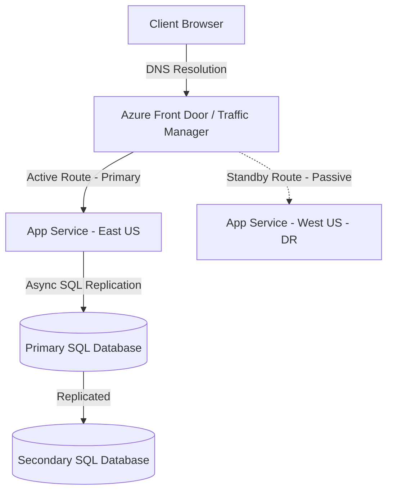

# Phase 11: Disaster Recovery

This phase details how to design, test, and execute a Disaster Recovery (DR) plan for your platform. You will learn about key DR metrics, data replication architectures, Traffic Manager failovers, and pipeline deployment workflows.

---

## 1. Theory & DR Design Metrics

### 1.1 Core DR Terminology
* **RTO (Recovery Time Objective)**: The target duration of time within which a business process or application must be restored after a disaster (e.g. "restore app within 4 hours").
* **RPO (Recovery Point Objective)**: The maximum acceptable amount of data loss measured in time (e.g. "no more than 1 hour of database transactions lost").
* **MTTR (Mean Time to Repair)**: The average time taken to repair a failed system.
* **MTBF (Mean Time Between Failures)**: The average active runtime of a system between occurrences of breakdown.
* **BCP (Business Continuity Plan)**: The broader corporate blueprint detailing how an organization continues operating during disruptions.

### 1.2 Data Replication Strategies
To support DR, databases and storage must replicate data across geographical regions:
* **Active-Passive DR**: The primary region (East US) runs active workloads. The DR region (West US) remains standby. If primary fails, traffic is routed to the secondary.
* **Azure SQL Geo-Replication**: Automatically replicates database transactions asynchronously to a read-only secondary database in a paired region.
* **Storage Accounts GRS (Geo-Redundant Storage)**: Replicates your files synchronously three times within the primary region, and asynchronously to a secondary region.

---

## 2. DR Architecture Diagram

Below is the multi-region failover network:



---

## 3. Complete DR Deployment YAML Pipeline

Save this file as `pipelines/dr-deployment.yml`. It deploys configurations to the DR region and switches Traffic Manager profiles:

```yaml
trigger: none

variables:
- group: vg-shared-config
- name: azureServiceConnection
  value: 'sc-azure-subscription-dev'
- name: primaryRG
  value: 'rg-devops-platform'
- name: drRG
  value: 'rg-devops-platform-dr'
- name: webAppNameDR
  value: 'app-enterprise-corebanking-dr'

pool:
  vmImage: 'ubuntu-latest'

stages:
- stage: DeployToDR
  displayName: 'Deploy Application to DR Region (West US)'
  jobs:
  - deployment: DeployDRJob
    environment: 'env-dr' # Triggers DR approval workflow
    strategy:
      runOnce:
        deploy:
          steps:
          # 1. Deploy App Package to DR App Service
          - task: AzureRmWebAppDeployment@4
            inputs:
              ConnectionType: 'AzureRM'
              azureSubscription: '$(azureServiceConnection)'
              appType: 'webApp'
              WebAppName: '$(webAppNameDR)'
              ResourceGroupName: '$(drRG)'
              packageForLinux: '$(Pipeline.Workspace)/drop/**/*.tar.gz'
            displayName: 'Deploy App to DR Web App'

- stage: TrafficFailover
  displayName: 'Execute DNS / Routing Failover'
  dependsOn: DeployToDR
  jobs:
  - job: FailoverJob
    steps:
    # 2. Update Traffic Manager / Front Door endpoint priority
    - task: AzureCLI@2
      inputs:
        azureSubscription: '$(azureServiceConnection)'
        scriptType: 'bash'
        scriptLocation: 'inlineScript'
        inlineScript: |
          echo "Updating Traffic Manager routing profile..."
          # Command to shift priority to DR endpoint:
          # az network traffic-manager endpoint update --profile-name tm-banking --resource-group $(primaryRG) --name endpoint-dr --type azureEndpoints --endpoint-status Enabled
        displayName: 'Route Traffic to DR Region'
```

---

## 4. Azure Portal UI Steps

### 4.1 Configuring Azure Traffic Manager
1. Log in to the **Azure Portal**. Search for **Traffic Manager profiles**. Click **Create**.
2. Name: `tm-banking-platform`. Routing method: Select **Priority**.
3. Resource Group: `rg-devops-platform`. Click **Create**.
4. Open the profile dashboard, navigate to the **Endpoints** menu, and click **+ Add**:
   * Type: `Azure endpoint`. Name: `endpoint-primary`. Target: Select your primary East US App Service. Set Priority to `1`. Click **Add**.
   * Click **+ Add** again. Name: `endpoint-dr`. Target: Select your West US DR App Service. Set Priority to `2`. Click **Add**.

### 4.2 Setting up SQL Database Geo-Replication (Cost-Optimized)
1. Open your **Azure SQL Database** dashboard in the Portal.
2. In the left menu, select **Data management** -> **Replicas**.
3. Click **+ Create replica**.
4. Target Server: Create a database server in the paired West US region.
5. Set compute/pricing tier to match primary (Basic DTU plan for student subscription).
6. Click **Review + Create**, then **Create**. Telemetry status will show "Seeding".

---

## 5. Validation Steps
1. Stop your primary App Service (East US) via the Azure Portal to simulate a regional outage.
2. Monitor Traffic Manager endpoint monitoring state. It should mark `endpoint-primary` as **Degraded**.
3. Attempt to access your application via the Traffic Manager profile URL (`http://tm-banking-platform.trafficmanager.net`). Verify you are routed to the DR App Service in West US.

---

## 6. Troubleshooting Steps
* **Failover delays**: Traffic Manager DNS records have a TTL (Time To Live). If users still hit the crashed primary, reduce the profile TTL setting from 300 seconds to 30 seconds.
* **Secondary Database Access Denied**: Ensure database connection strings for the DR App Service point to the read-only secondary replica, or verify failover group link states.

---

## 7. Interview Questions & Answers

1. **What is RTO and RPO?**
   * *Answer*: RTO is the target duration to restore a service after a failure. RPO is the maximum acceptable duration of data loss from a disaster.
2. **What is the difference between active-passive and active-active DR?**
   * *Answer*: Active-passive runs traffic in one region while keeping the secondary on standby. Active-active serves traffic from both regions concurrently, utilizing active load balancers.
3. **What is Azure Traffic Manager?**
   * *Answer*: A DNS-based traffic load balancer that distributes client requests to endpoints across different global regions based on priority, performance, or geographic rules.
4. **How does geo-replication work in Azure SQL?**
   * *Answer*: It asynchronously replicates transactions committed to the primary database to a secondary database replica located in another Azure region.
5. **What is a recovery runbook?**
   * *Answer*: A step-by-step instruction manual detailing the tasks, commands, and approval workflows needed to recover systems during an outage.
6. **Explain the role of DNS TTL in DR.**
   * *Answer*: TTL (Time to Live) determines how long DNS resolvers cache routing records. Lower TTL ensures faster traffic redirection during failover.
7. **What is Azure Front Door?**
   * *Answer*: A global, secure entry-point application delivery network (layer 7 load balancer) that uses Microsoft's global edge network for routing and web application firewalling.
8. **What is a GameDay exercise?**
   * *Answer*: A planned drill where teams simulate a production outage to test recovery plans, check system metrics, and validate team response speeds.
9. **How do you replicate files in Azure Storage?**
   * *Answer*: By configuring GRS (Geo-Redundant Storage), which replicates data to a secondary region hundreds of miles away from the primary site.
10. **What is failback?**
    * *Answer*: The process of returning application operations back to the primary deployment region once the outage has resolved and data has synced back.
11. **Why is SQL database replication asynchronous?**
    * *Answer*: Synchronous replication across long distances introduces network latency to every transaction. Asynchronous replication prevents performance hits but risks minor data loss (RPO).
12. **Can you automate Traffic Manager failover?**
    * *Answer*: Yes. Traffic Manager monitors endpoint health probes and auto-shifts priority to healthy endpoints when primary goes offline.
13. **What is chaos engineering?**
    * *Answer*: The practice of intentionally introducing failures (e.g. shutting down servers, dropping network connections) to test system resilience.
14. **What is a tabletop exercise?**
    * *Answer*: A discussion-based drill where team members walk through a disaster scenario step-by-step around a table without changing real systems.
15. **Why should the DR environment use Infrastructure as Code?**
    * *Answer*: To guarantee that the DR environment matches production configuration exactly, and to allow building it from scratch quickly.
16. **How do you keep container registries (ACR) synchronized for DR?**
    * *Answer*: Enable registry geo-replication (Premium SKU feature) or build a pipeline that pushes images to registries in both regions.
17. **What is a multi-region deployment?**
    * *Answer*: Deploying identical application stacks to two or more geographical regions.
18. **What is the difference between failover and failback?**
    * *Answer*: Failover moves operations to the DR site. Failback moves operations back to the primary site.
19. **What is MTBF?**
    * *Answer*: Mean Time Between Failures. A metric tracking system reliability.
20. **Can you run DR checks on Azure DevOps?**
    * *Answer*: Yes, by setting up approvals, checks, and testing pipelines specifically for the DR environment resources.

---

## 8. Real Industry Practices
* **No Manual Swaps**: Automate failover alerts using DNS health checkers. Avoid manual network modifications during high-stress outages.
* **Test the Backups**: Test backup restoration weekly to ensure backups are not corrupted.

---

## 9. Production Best Practices
* **Keep DR Code up to Date**: Deploy code updates to the DR region concurrently with production updates to prevent version mismatches.
* **Scale Down DR Standby**: To save cost, keep the DR standby app service plan scaled down, and scale it up automatically during a failover event.

---

## 10. Common Failure Scenarios
* **Split-Brain Scenario**: Occurs when both primary and secondary databases believe they are the active write targets, leading to database schema and transaction corruption.
* **Expired Certificates**: Failover fails because the SSL certificate on the DR web app expired unnoticed. Include DR endpoints in certificate monitoring scripts.
